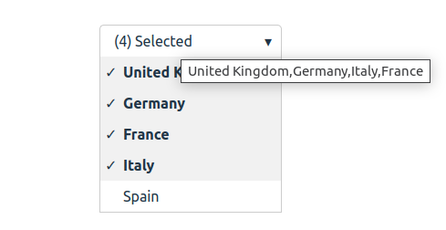

# React MultiSelect Multiselect Component

A reusable React + TypeScript multi-select Multiselect component.

---

## Features

- Multiple item selection
- Click outside to close
- `onChange` callback provides selected items
- TypeScript support
- Simple CSS styling (customizable)

---

## Installation

Clone the repository and install dependencies:

```bash
git clone https://github.com/<your-username>/<repo-name>.git
cd <repo-name>
npm install
npm run dev
```

## Usage Example

```tsx
import React, { useState } from "react";
import { Multiselect } from "./components/Multiselect";

const App = () => {
  const [selected, setSelected] = useState<string[]>([]);

  const handleSelectionChange = (items: string[]) => {
    setSelected(items);
    console.log("Selected items:", items);
  };

  return (
    <div>
      <h2>Choose fruits:</h2>
      <Multiselect
        data={["Apple", "Banana", "Orange"]}
        onChange={handleSelectionChange}
      />
      <p>Selected: {selected.join(", ")}</p>
    </div>
  );
};

export default App;
```

## Screenshot


